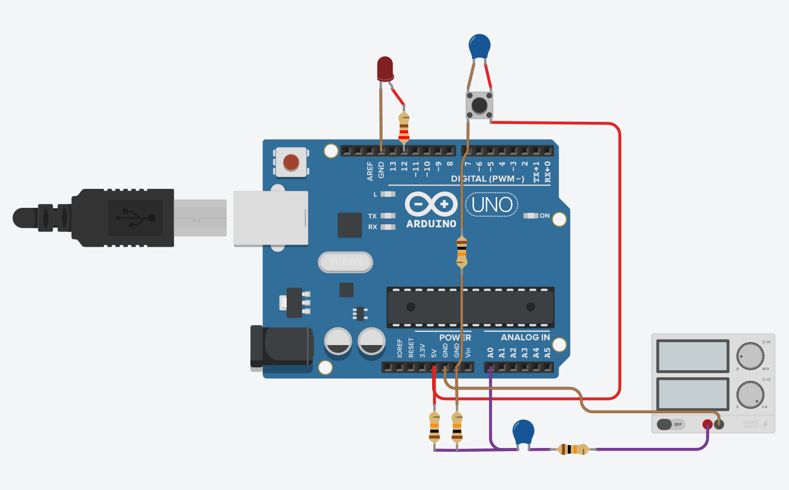

# 🎧 Monitor de Sinal de Áudio com Alarme – Arduino

Este projeto utiliza um Arduino para monitorar sinais de áudio e acionar um alarme visual caso o sinal fique ausente por mais de 20 segundos. Um LED pisca com a presença de sinal, enquanto outro LED de alto brilho acende para indicar ausência prolongada. Um botão físico permite resetar o alarme.

---

## 📷 Imagens do Projeto

  
*Circuito com Arduino, divisor de tensão, capacitor de acoplamento e LEDs.*

---

## ⚙️ Componentes Utilizados

- Arduino Uno  
- LED interno (pino 13 – pisca com sinal)  
- LED de alto brilho vermelho (pino 12 – alarme)  
- Resistor 220 Ω (para LED de alto brilho)  
- Capacitor cerâmico 104 (100 nF)  
- 3x resistores de 10 kΩ (divisor de tensão e entrada de áudio)  
- Botão com resistor e capacitor para debounce (pino 7)  
- Fonte de sinal de áudio (fone, saída de linha, etc.)

---

## 🔌 Esquema de Funcionamento

- O sinal de áudio entra por um capacitor de acoplamento e passa por um divisor de tensão.  
- O Arduino lê o sinal analógico no pino A0.  
- Se o sinal ultrapassa 515, o LED do pino 13 pisca.  
- Se o sinal não ultrapassar 515 por 60 segundos, o LED do pino 12 acende (alarme).  
- O botão no pino 7 pode ser pressionado para apagar o LED de alarme e reiniciar o monitoramento.

---

## 🧠 Código-fonte

O código está disponível no arquivo `main.cpp`. Ele inclui lógica para leitura do sinal, controle dos LEDs e reset por botão com debounce externo.

---

## 📄 Licença

Este projeto está sob a licença MIT. Sinta-se livre para modificar, compartilhar e contribuir!
